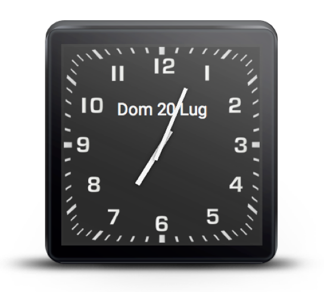

#Simple project for Android Watch Face

This use a simple layout (for square watches)

##Instruction

- Create an activity that implements `WatchFaceLifecycle.Listener` (to be updated on state changes
of watchFace)

- Use this settings in you AndroidManifest.xml

```xml
    <uses-feature android:name="android.hardware.type.watch" />
    <uses-permission android:name="com.google.android.permission.PROVIDE_BACKGROUND" />
    <uses-permission android:name="android.permission.WAKE_LOCK" />
```

- Add this attributes to your application (if not already present)

```xml
        android:allowBackup="true"
        android:theme="@android:style/Theme.DeviceDefault"
```

- Add this attributes tu you watch activity

```xml
    android:theme="@android:style/Theme.DeviceDefault.NoActionBar"
    android:enabled="true"
    android:taskAffinity=""
    android:allowEmbedded="true"
```

- Add this metadata and intent-filter to you watch activity

```xml
    <meta-data android:name="com.google.android.clockwork.home.preview"
            android:resource="@drawable/preview" />

    <intent-filter>
        <action android:name="android.intent.action.MAIN" />
        <category android:name="com.google.android.clockwork.home.category.HOME_BACKGROUND" />
    </intent-filter>
```

- Add this meta-data to your application (not inside the activity tag)

```xml
        <meta-data android:name="com.google.android.gms.version"
            android:value="@integer/google_play_services_version" />
```


##Screenshot




##Thanks

Thanks to **Paul Blundell** to his WatchFaceLifecycle


##License

SquareWatchFace is released under the *Apache License 2.0*

    Copyright 2014-2015 Fabrizio Russo (www.frusso.it)

        Licensed under the Apache License, Version 2.0 (the "License");
        you may not use this file except in compliance with the License.
        You may obtain a copy of the License at

           http://www.apache.org/licenses/LICENSE-2.0

        Unless required by applicable law or agreed to in writing, software
        distributed under the License is distributed on an "AS IS" BASIS,
        WITHOUT WARRANTIES OR CONDITIONS OF ANY KIND, either express or implied.
        See the License for the specific language governing permissions and
        limitations under the License.

